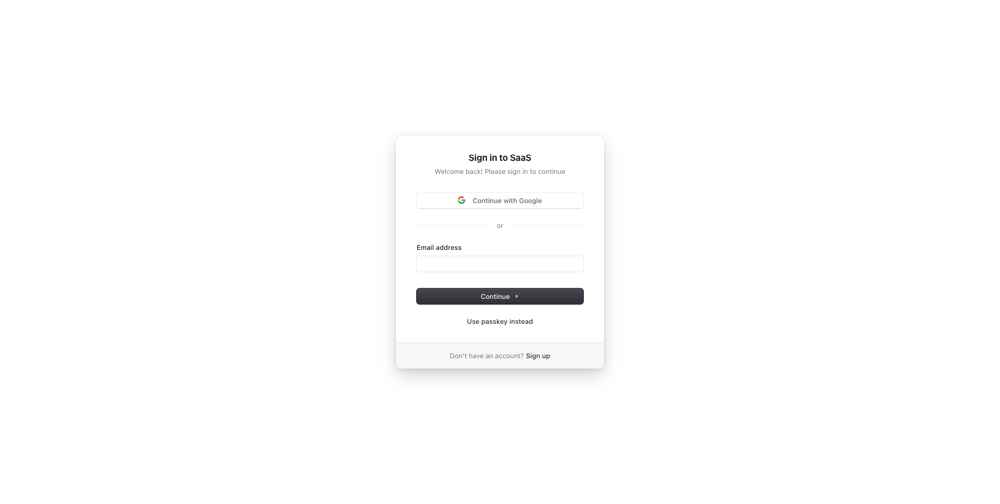

# Clean Next.js 16+ Starter with Tailwind CSS 4 and TypeScript

<p align="center">
  <a href="https://demo.nextjs-boilerplate.com">
    
  </a>
</p>

🚀 A minimal, clean Next.js boilerplate with App Router, Tailwind CSS, and TypeScript ⚡️ Focused on developer experience: Next.js 16, TypeScript, ESLint, Prettier, VSCode configuration, Tailwind CSS 4, Authentication with [Clerk](https://clerk.com?utm_source=github&utm_medium=sponsorship&utm_campaign=nextjs-boilerplate), Error Monitoring with [Sentry](https://sentry.io/for/nextjs/?utm_source=github&utm_medium=paid-community&utm_campaign=general-fy25q1-nextjs&utm_content=github-banner-nextjsboilerplate-logo), Logging with LogTape, Multi-language (i18n) with next-intl, Analytics with PostHog, and more.

Clone this project and use it to create your own Next.js project. Includes a working authentication system with Clerk.

## Sponsors

<table width="100%">
  <tr height="187px">
    <td align="center" width="33%">
      <a href="https://clerk.com?utm_source=github&utm_medium=sponsorship&utm_campaign=nextjs-boilerplate">
        <picture>
          <source media="(prefers-color-scheme: dark)" srcset="https://github.com/ixartz/SaaS-Boilerplate/assets/1328388/6fb61971-3bf1-4580-98a0-10bd3f1040a2">
          <source media="(prefers-color-scheme: light)" srcset="https://github.com/ixartz/SaaS-Boilerplate/assets/1328388/f80a8bb5-66da-4772-ad36-5fabc5b02c60">
          
        </picture>
      </a>
    </td>
    <td align="center" width="33%">
      <a href="https://sentry.io/for/nextjs/?utm_source=github&utm_medium=paid-community&utm_campaign=general-fy25q1-nextjs&utm_content=github-banner-nextjsboilerplate-logo">
        <picture>
          <source media="(prefers-color-scheme: dark)" srcset="public/assets/images/sentry-white.png?raw=true">
          <source media="(prefers-color-scheme: light)" srcset="public/assets/images/sentry-dark.png?raw=true">
          
        </picture>
      </a>
    </td>
    <td align="center" width="33%">
      <a href="https://betterstack.com/?utm_source=github&utm_medium=sponsorship&utm_campaign=next-js-boilerplate">
        <picture>
          <source media="(prefers-color-scheme: dark)" srcset="public/assets/images/better-stack-white.png?raw=true">
          <source media="(prefers-color-scheme: light)" srcset="public/assets/images/better-stack-dark.png?raw=true">
          
        </picture>
      </a>
    </td>
  </tr>
  <tr height="187px">
    <td align="center" width="33%">
      <a href="https://posthog.com/?utm_source=github&utm_medium=sponsorship&utm_campaign=next-js-boilerplate">
        <picture>
          <source media="(prefers-color-scheme: dark)" srcset="https://posthog.com/brand/posthog-logo-white.svg">
          <source media="(prefers-color-scheme: light)" srcset="https://posthog.com/brand/posthog-logo.svg">
          
        </picture>
      </a>
    </td>
    <td align="center" style=width="33%">
      <a href="https://nextjs-boilerplate.com/pro-saas-starter-kit">
        
      </a>
    </td>
  </tr>
</table>

### Demo

**Live demo: [Next.js Boilerplate](https://demo.nextjs-boilerplate.com)**

| Sign Up | Sign In |
| --- | --- |
| [](https://demo.nextjs-boilerplate.com/sign-up) | [](https://demo.nextjs-boilerplate.com/sign-in) |

### Features

Developer experience first, minimal and clean code structure:

- ⚡ [Next.js](https://nextjs.org) 16 with App Router support
- 🔥 Type checking with [TypeScript](https://www.typescriptlang.org)
- 💎 Integrate with [Tailwind CSS](https://tailwindcss.com) 4
- ✅ Strict Mode for TypeScript and React 19
- 🔒 Authentication with [Clerk](https://clerk.com?utm_source=github&utm_medium=sponsorship&utm_campaign=nextjs-boilerplate): Sign up, Sign in, Sign out, Forgot password, Reset password, and more
- 👤 Passwordless Authentication with Magic Links, Multi-Factor Auth (MFA), Social Auth (Google, Facebook, Twitter, GitHub, Apple, and more), Passwordless login with Passkeys, User Impersonation
- 🌐 Multi-language (i18n) with next-intl
- ♻️ Type-safe environment variables with T3 Env
- ⌨️ Form handling with React Hook Form
- 🔴 Validation library with Zod
- 📏 Linter with [ESLint](https://eslint.org) (default Next.js, Next.js Core Web Vitals, Tailwind CSS and Antfu configuration)
- 💖 Code Formatter with Prettier
- 🔍 Unused files and dependencies detection with Knip
- 🌍 I18n validation and missing translation detection with i18n-check
- 🚨 Error Monitoring with [Sentry](https://sentry.io/for/nextjs/?utm_source=github&utm_medium=paid-community&utm_campaign=general-fy25q1-nextjs&utm_content=github-banner-nextjsboilerplate-logo)
- 📝 Logging with LogTape and Log Management with [Better Stack](https://betterstack.com/?utm_source=github&utm_medium=sponsorship&utm_campaign=next-js-boilerplate)
- 📊 Analytics with PostHog
- 💡 Absolute Imports using `@` prefix
- 🗂 VSCode configuration: Debug, Settings, Tasks and Extensions
- 🤖 SEO metadata, JSON-LD and Open Graph tags
- 🗺️ Sitemap.xml and robots.txt
- ⚙️ Bundler Analyzer
- 🌈 Include a FREE minimalist theme
- 💯 Maximize lighthouse score

Built-in feature from Next.js:

- ☕ Minify HTML & CSS
- 💨 Live reload
- ✅ Cache busting

### Philosophy

- Nothing is hidden from you, allowing you to make any necessary adjustments to suit your requirements and preferences.
- Dependencies are regularly updated on a monthly basis
- Start for free without upfront costs
- Easy to customize
- Minimal code
- Unstyled template
- SEO-friendly
- 🚀 Production-ready

### Requirements

- Node.js 22+ and npm

### Getting started

Run the following command on your local environment:

```shell
git clone --depth=1 https://github.com/ixartz/Next-js-Boilerplate.git my-project-name
cd my-project-name
npm install
```

For your information, all dependencies are updated every month.

Then, you can run the project locally in development mode with live reload by executing:

```shell
npm run dev
```

Open http://localhost:3000 with your favorite browser to see your project.

Need advanced features? Multi-tenancy & Teams, Roles & Permissions, Shadcn UI, End-to-End Typesafety with oRPC, Stripe Payment, Light / Dark mode. Try [Next.js Boilerplate Pro](https://nextjs-boilerplate.com/pro-saas-starter-kit).

### Set up authentication

To get started, you will need to create a Clerk account at [Clerk.com](https://clerk.com?utm_source=github&utm_medium=sponsorship&utm_campaign=nextjs-boilerplate) and create a new application in the Clerk Dashboard. Once you have done that, copy the `NEXT_PUBLIC_CLERK_PUBLISHABLE_KEY` and `CLERK_SECRET_KEY` values and add them to the `.env.local` file (not tracked by Git):

```shell
NEXT_PUBLIC_CLERK_PUBLISHABLE_KEY=your_clerk_pub_key
CLERK_SECRET_KEY=your_clerk_secret_key
```

Now you have a fully functional authentication system with Next.js, including features such as sign up, sign in, sign out, forgot password, reset password, update profile, update password, update email, delete account, and more.

### Translation (i18n) setup

For translation, the project uses `next-intl`. The localization files are located in `src/locales/` directory. Currently supporting English (en) and French (fr). You can easily add more languages by creating additional JSON files in the locales directory.

### Project structure

```shell
.
├── README.md                       # README file
├── .vscode                         # VSCode configuration
├── public                          # Public assets folder
├── src
│   ├── app                         # Next JS App (App Router)
│   ├── components                  # React components
│   ├── libs                        # 3rd party libraries configuration
│   ├── locales                     # Locales folder (i18n messages)
│   ├── styles                      # Styles folder
│   ├── templates                   # Templates folder
│   ├── types                       # Type definitions
│   └── utils                       # Utilities folder
├── next.config.ts                  # Next JS configuration
└── tsconfig.json                   # TypeScript configuration
```

### Customization

You can easily configure Next js Boilerplate by searching the entire project for `FIXME:` to make quick customizations. Here are some of the most important files to customize:

- `public/apple-touch-icon.png`, `public/favicon.ico`, `public/favicon-16x16.png` and `public/favicon-32x32.png`: your website favicon
- `src/utils/AppConfig.ts`: configuration file
- `src/templates/BaseTemplate.tsx`: default theme
- `next.config.ts`: Next.js configuration
- `.env`: default environment variables

You have full access to the source code for further customization. The provided code is just an example to help you start your project. The sky's the limit 🚀.

### Deploy to production

You can generate a production build with:

```shell
$ npm run build
```

It generates an optimized production build of the boilerplate. To test the generated build, run:

```shell
$ npm run start
```

You also need to defined the environment variables `CLERK_SECRET_KEY` using your own key.

This command starts a local server using the production build. You can now open http://localhost:3000 in your preferred browser to see the result.

### Deploy to Sevalla

You can deploy a Next.js application along with its database on a single platform. First, create an account on [Sevalla](https://sevalla.com).

After registration, you will be redirected to the dashboard. From there, navigate to `Database > Create a database`. Select PostgreSQL and and use the default settings for a quick setup. For advanced users, you can customize the database location and resource size. Finally, click on `Create` to complete the process.

Once the database is created and ready, return to the dashboard and click `Application > Create an App`. After connecting your GitHub account, select the repository you want to deploy. Keep the default settings for the remaining options, then click `Create`.

Next, connect your database to your application by going to `Networking > Connected services > Add connection` and select the database you just created. You also need to enable the `Add environment variables to the application` option, and rename `DB_URL` to `DATABASE_URL`. Then, click `Add connection`.

Go to `Environment variables > Add environment variable`, and define the environment variables `NEXT_PUBLIC_CLERK_PUBLISHABLE_KEY` and `CLERK_SECRET_KEY` from your Clerk account. Click `Save`.

Finally, initiate a new deployment by clicking `Overview > Latest deployments > Deploy now`. If everything is set up correctly, your application will be deployed successfully with a working database.

### Error Monitoring

The project uses [Sentry](https://sentry.io/for/nextjs/?utm_source=github&utm_medium=paid-community&utm_campaign=general-fy25q1-nextjs&utm_content=github-banner-nextjsboilerplate-logo) to monitor errors.

#### Local development with Sentry and Spotlight

In the development environment, no additional setup is required: Next.js Boilerplate comes pre-configured with Sentry and Spotlight (Sentry for Development). All errors are automatically captured by your local Spotlight instance, enabling testing without sending data to Sentry Cloud.

You can inspect captured events, view stack traces, and analyze errors in the Spotlight UI at `http://localhost:8969`.

#### Production setup with Sentry

For production environment, you'll need to create a Sentry account and a new project. Then, in `.env.production`, you need to update the following environment variables:

```shell
NEXT_PUBLIC_SENTRY_DSN=
SENTRY_ORGANIZATION=
SENTRY_PROJECT=
```

You also need to create a environment variable `SENTRY_AUTH_TOKEN` in your hosting provider's dashboard.

### Code coverage

Next.js Boilerplate relies on [Codecov](https://about.codecov.io/codecov-free-trial/?utm_source=github&utm_medium=paid-community&utm_campaign=general-fy25q1-nextjs&utm_content=github-banner-nextjsboilerplate-logo) for code coverage reporting solution. To enable Codecov, create a Codecov account and connect it to your GitHub account. Your repositories should appear on your Codecov dashboard. Select the desired repository and copy the token. In GitHub Actions, define the `CODECOV_TOKEN` environment variable and paste the token.

Make sure to create `CODECOV_TOKEN` as a GitHub Actions secret, do not paste it directly into your source code.

### Logging

The project uses LogTape for logging. In the development environment, logs are displayed in the console by default.

For production, the project is already integrated with [Better Stack](https://betterstack.com/?utm_source=github&utm_medium=sponsorship&utm_campaign=next-js-boilerplate) to manage and query your logs using SQL. To use Better Stack, you need to create a [Better Stack](https://betterstack.com/?utm_source=github&utm_medium=sponsorship&utm_campaign=next-js-boilerplate) account and create a new source: go to your Better Stack Logs Dashboard > Sources > Connect source. Then, you need to give a name to your source and select Node.js as the platform.

After creating the source, you will be able to view and copy your source token. In your environment variables, paste the token into the `NEXT_PUBLIC_BETTER_STACK_SOURCE_TOKEN` variable. You'll also need to define the `NEXT_PUBLIC_BETTER_STACK_INGESTING_HOST` variable, which can be found in the same place as the source token.

Now, all logs will automatically be sent to and ingested by Better Stack.

### Checkly monitoring

The project uses [Checkly](https://www.checklyhq.com/?utm_source=github&utm_medium=sponsorship&utm_campaign=next-js-boilerplate) to ensure that your production environment is always up and running. At regular intervals, Checkly runs the tests ending with `*.check.e2e.ts` extension and notifies you if any of the tests fail. Additionally, you have the flexibility to execute tests from multiple locations to ensure that your application is available worldwide.

To use Checkly, you must first create an account on [their website](https://www.checklyhq.com/?utm_source=github&utm_medium=sponsorship&utm_campaign=next-js-boilerplate). After creating an account, generate a new API key in the Checkly Dashboard and set the `CHECKLY_API_KEY` environment variable in GitHub Actions. Additionally, you will need to define the `CHECKLY_ACCOUNT_ID`, which can also be found in your Checkly Dashboard under User Settings > General.

To complete the setup, update the `checkly.config.ts` file with your own email address and production URL.

### Arcjet security and bot protection

The project uses [Arcjet](https://launch.arcjet.com/Q6eLbRE), a security as code product that includes several features that can be used individually or combined to provide defense in depth for your site.

To set up Arcjet, [create a free account](https://launch.arcjet.com/Q6eLbRE) and get your API key. Then add it to the `ARCJET_KEY` environment variable.

Arcjet is configured with two main features: bot detection and the Arcjet Shield WAF:

- [Bot detection](https://docs.arcjet.com/bot-protection/concepts) is configured to allow search engines, preview link generators e.g. Slack and Twitter previews, and to allow common uptime monitoring services. All other bots, such as scrapers and AI crawlers, will be blocked. You can [configure additional bot types](https://docs.arcjet.com/bot-protection/identifying-bots) to allow or block.
- [Arcjet Shield WAF](https://docs.arcjet.com/shield/concepts) will detect and block common attacks such as SQL injection, cross-site scripting, and other OWASP Top 10 vulnerabilities.

Arcjet is configured with a central client at `src/libs/Arcjet.ts` that includes the Shield WAF rules. Additional rules are applied when Arcjet is called in `middleware.ts`.

### Useful commands

### Code Quality and Validation

The project includes several commands to ensure code quality and consistency. You can run:

- `npm run lint` to check for linting errors
- `npm run lint:fix` to automatically fix fixable issues from the linter
- `npm run check:types` to verify type safety across the entire project
- `npm run check:deps` help identify unused dependencies and files
- `npm run check:i18n` ensures all translations are complete and properly formatted

#### Bundle Analyzer

Next.js Boilerplate includes a built-in bundle analyzer. It can be used to analyze the size of your JavaScript bundles. To begin, run the following command:

```shell
npm run build-stats
```

By running the command, it'll automatically open a new browser window with the results.

#### Database Studio

The project is already configured with Drizzle Studio to explore the database. You can run the following command to open the database studio:

```shell
npm run db:studio
```

Then, you can open https://local.drizzle.studio with your favorite browser to explore your database.

### VSCode information (optional)

If you are VSCode user, you can have a better integration with VSCode by installing the suggested extension in `.vscode/extension.json`. The starter code comes up with Settings for a seamless integration with VSCode. The Debug configuration is also provided for frontend and backend debugging experience.

With the plugins installed in your VSCode, ESLint and Prettier can automatically fix the code and display errors. The same applies to testing: you can install the VSCode Vitest extension to automatically run your tests, and it also shows the code coverage in context.

Pro tips: if you need a project wide-type checking with TypeScript, you can run a build with <kbd>Cmd</kbd> + <kbd>Shift</kbd> + <kbd>B</kbd> on Mac.

### Contributions

Everyone is welcome to contribute to this project. Feel free to open an issue if you have any questions or find a bug. Totally open to suggestions and improvements.

### License

Licensed under the MIT License, Copyright © 2025

See [LICENSE](LICENSE) for more information.

## Sponsors

<table width="100%">
  <tr height="187px">
    <td align="center" width="33%">
      <a href="https://clerk.com?utm_source=github&utm_medium=sponsorship&utm_campaign=nextjs-boilerplate">
        <picture>
          <source media="(prefers-color-scheme: dark)" srcset="https://github.com/ixartz/SaaS-Boilerplate/assets/1328388/6fb61971-3bf1-4580-98a0-10bd3f1040a2">
          <source media="(prefers-color-scheme: light)" srcset="https://github.com/ixartz/SaaS-Boilerplate/assets/1328388/f80a8bb5-66da-4772-ad36-5fabc5b02c60">
          
        </picture>
      </a>
    </td>
    <td align="center" width="33%">
      <a href="https://www.coderabbit.ai?utm_source=next_js_starter&utm_medium=github&utm_campaign=next_js_starter_oss_2025">
        <picture>
          <source media="(prefers-color-scheme: dark)" srcset="public/assets/images/coderabbit-logo-dark.svg?raw=true">
          <source media="(prefers-color-scheme: light)" srcset="public/assets/images/coderabbit-logo-light.svg?raw=true">
          
        </picture>
      </a>
    </td>
    <td align="center" width="33%">
      <a href="https://sentry.io/for/nextjs/?utm_source=github&utm_medium=paid-community&utm_campaign=general-fy25q1-nextjs&utm_content=github-banner-nextjsboilerplate-logo">
        <picture>
          <source media="(prefers-color-scheme: dark)" srcset="public/assets/images/sentry-white.png?raw=true">
          <source media="(prefers-color-scheme: light)" srcset="public/assets/images/sentry-dark.png?raw=true">
          
        </picture>
      </a>
      <a href="https://about.codecov.io/codecov-free-trial/?utm_source=github&utm_medium=paid-community&utm_campaign=general-fy25q1-nextjs&utm_content=github-banner-nextjsboilerplate-logo">
        <picture>
          <source media="(prefers-color-scheme: dark)" srcset="public/assets/images/codecov-white.svg?raw=true">
          <source media="(prefers-color-scheme: light)" srcset="public/assets/images/codecov-dark.svg?raw=true">
          
        </picture>
      </a>
    </td>
  </tr>
  <tr height="187px">
    <td align="center" width="33%">
      <a href="https://launch.arcjet.com/Q6eLbRE">
        <picture>
          <source media="(prefers-color-scheme: dark)" srcset="public/assets/images/arcjet-dark.svg?raw=true">
          <source media="(prefers-color-scheme: light)" srcset="public/assets/images/arcjet-light.svg?raw=true">
          
        </picture>
      </a>
    </td>
    <td align="center" width="33%">
      <a href="https://sevalla.com/">
        <picture>
          <source media="(prefers-color-scheme: dark)" srcset="public/assets/images/sevalla-dark.png">
          <source media="(prefers-color-scheme: light)" srcset="public/assets/images/sevalla-light.png">
          
        </picture>
      </a>
    </td>
    <td align="center" width="33%">
      <a href="https://l.crowdin.com/next-js">
        <picture>
          <source media="(prefers-color-scheme: dark)" srcset="public/assets/images/crowdin-white.png?raw=true">
          <source media="(prefers-color-scheme: light)" srcset="public/assets/images/crowdin-dark.png?raw=true">
          
        </picture>
      </a>
    </td>
  </tr>
  <tr height="187px">
    <td align="center" width="33%">
      <a href="https://betterstack.com/?utm_source=github&utm_medium=sponsorship&utm_campaign=next-js-boilerplate">
        <picture>
          <source media="(prefers-color-scheme: dark)" srcset="public/assets/images/better-stack-white.png?raw=true">
          <source media="(prefers-color-scheme: light)" srcset="public/assets/images/better-stack-dark.png?raw=true">
          
        </picture>
      </a>
    </td>
    <td align="center" width="33%">
      <a href="https://posthog.com/?utm_source=github&utm_medium=sponsorship&utm_campaign=next-js-boilerplate">
        <picture>
          <source media="(prefers-color-scheme: dark)" srcset="https://posthog.com/brand/posthog-logo-white.svg">
          <source media="(prefers-color-scheme: light)" srcset="https://posthog.com/brand/posthog-logo.svg">
          
        </picture>
      </a>
    </td>
    <td align="center" width="33%">
      <a href="https://www.checklyhq.com/?utm_source=github&utm_medium=sponsorship&utm_campaign=next-js-boilerplate">
        <picture>
          <source media="(prefers-color-scheme: dark)" srcset="public/assets/images/checkly-logo-dark.png?raw=true">
          <source media="(prefers-color-scheme: light)" srcset="public/assets/images/checkly-logo-light.png?raw=true">
          
        </picture>
      </a>
    </td>
  </tr>
  <tr height="187px">
    <td align="center" style=width="33%">
      <a href="https://nextjs-boilerplate.com/pro-saas-starter-kit">
        
      </a>
    </td>
    <td align="center" width="33%">
      <a href="mailto:contact@creativedesignsguru.com">
        Add your logo here
      </a>
    </td>
  </tr>
</table>

---

Made with ♥ by [CreativeDesignsGuru](https://creativedesignsguru.com) [](https://twitter.com/ixartz)

Looking for a custom boilerplate to kick off your project? I'd be glad to discuss how I can help you build one. Feel free to reach out anytime at contact@creativedesignsguru.com!

[](https://github.com/sponsors/ixartz)
